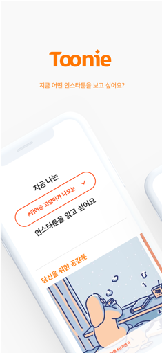
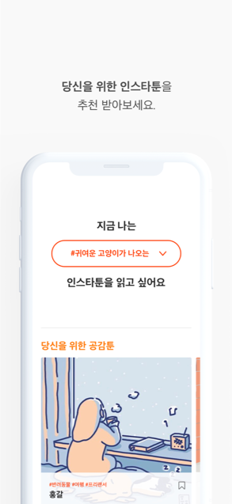
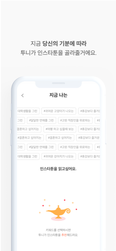
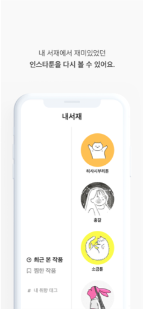

# Toonie  
<p align="center">
  
  
  <a href="https://travis-ci.org/boostcamp3-iOS/team-c2" target="_blank">
    
  </a>
</p>


## 팀원 정보

**iOS 클라이언트** :  [박은비](https://github.com/ebPark9511) [양어진](https://github.com/eojine) [이재은](https://github.com/Jae-eun)

**서버** :  [조경현](https://github.com/EddyJo)


## 앱 소개

### 키워드를 통한 인스타툰 추천 서비스

- 사용자가 선택한 취향 태그를 기반으로 인스타툰을 추천합니다.
- 최근 본 작품 및 찜한 작품과 연관된 인스타툰도 추천합니다.
- 장르와 세부 키워드로 분류된 인스타툰을 찾아볼 수 있습니다.


# #






## 버전 정보 

> version 1.0


## 앱 스토어

<a href="https://www.apple.com/itunes/"> </a>

## 

### 활용 기술

- **[SwiftLint](https://github.com/realm/SwiftLint)** : 명확하고 깔끔한 코드 작성과 팀원 간의 코드 이해를 도움

```yaml
# .swiftlint.yml
disabled_rules:
- leading_whitespace
- trailing_whitespace

included:

line_length:
warning: 99
error: 120

excluded:
- Toonie/Supporting Files/AppDelegate.swift
- Pods
```

- **[xUnique](https://github.com/truebit/xUnique)** : `project.pbxproj` 파일의 충돌을 최소화하고 해결을 도움
- **[Travis CI](https://travis-ci.org/yapp-project/Toonie)** : 자동 빌드 테스트를 통해 안정성 있는 코드 통합을 함
- Kingfisher
- Alamofire
- Lottie
- SnapKit
- WebKit
